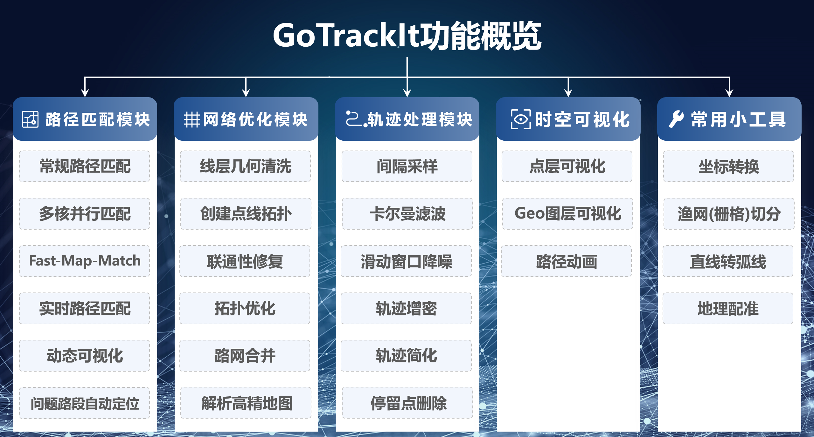
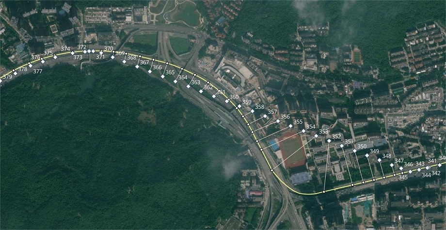

# GoTrackIt简介

GoTrackIt是一个基于改进隐马尔可夫模型实现的**全流程地图匹配**pyhon包， 通过概率图建模的方式将车辆的GPS轨迹数据匹配到道路路网， 获取车辆的标准化时空轨迹， 可以有效支撑出行导航、交通监测、交通治理、碳排核算、交通建模等方向。

!!! note 
    
    这个项目正处在频繁的升级迭代期， 当前版本v0.3.14， 请用户及时更新.

<figure markdown="span">
  
  <figcaption>地图匹配(路径匹配)</figcaption>
</figure>

<figure markdown="span">
  
  <figcaption>路径匹配的应用场景</figcaption>
</figure>

## GoTrackIt功能特点
本地图匹配包基于隐马尔可夫模型(HMM)实现了连续GPS点位的概率建模，利用这个包可以轻松对GPS数据进行地图匹配，本开源包的特点如下:

### 😻数据无忧
- [x] 提供路网生产模块(只需提供一个key即可获取路网)以及大量路网处理优化工具，您不需要准备任何路网和GPS数据即可玩转地图匹配；
- [x] 提供GPS样例数据生产模块，解决没有GPS数据的难题；
- [x]  提供GPS数据清洗接口，包括行程切分、滤波平滑、停留点识别等。

### ☑️文档齐全
- [x] 中文文档，有详细的操作指引；
- [x] 算法原理讲解部分不涉及复杂的公式推导，使用动画形式剖析算法原理，简洁明了。

### 🚀匹配算法优化
- [x] 支持基于路径预计算的FastMapMatching、支持多核并行匹配、支持网格参数搜索；
- [x] 对基于HMM匹配的初步路径进行了优化，对于不连通的位置会自动搜路补全，对于实际路网不连通的位置会输出警告信息，方便用户回溯问题。

### 🌈匹配结果支持动画可视化
- [x] 匹配结果提供三种输出形式：GPS点匹配结果表(csv)、匹配结果矢量化图层、矢量图层匹配动画(HTML文件)，HTML动画方便用户直观地感受匹配结果，同时可以提高问题排查的效率。

## GoTrackIt功能框架

<figure markdown="span">
  
  <figcaption>GoTrackIt功能框架</figcaption>
</figure>

## GoTrackIt匹配效果

<figure markdown="span">
  
  <figcaption>稀疏轨迹匹配</figcaption>
</figure>

<figure markdown="span">
  
  <figcaption>常规轨迹匹配</figcaption>
</figure>

<figure markdown="span">
  
  <figcaption>常规轨迹匹配</figcaption>
</figure>

<figure markdown="span">
  
  <figcaption>多车匹配可视化</figcaption>
</figure>

<figure markdown="span">
  
  <figcaption>匹配结果GeoJSON可视化</figcaption>
</figure>

## GoTrackIt视频教程

- [x] [基于隐马尔可夫模型(HMM)的地图匹配算法动画版！学不会你来打我](https://www.bilibili.com/video/BV1gQ4y1w7dC)

- [x] [一个python包搞定路网获取+地图匹配](https://www.bilibili.com/video/BV1nC411z7Vg)

- [x] [gotrackit地图匹配包参数详解与问题排查](https://www.bilibili.com/video/BV1qK421Y7hV)

- [x] [QGIS路网拓扑显示、底图加载、样式复用、map保存](https://www.bilibili.com/video/BV1Sq421F7QX)
